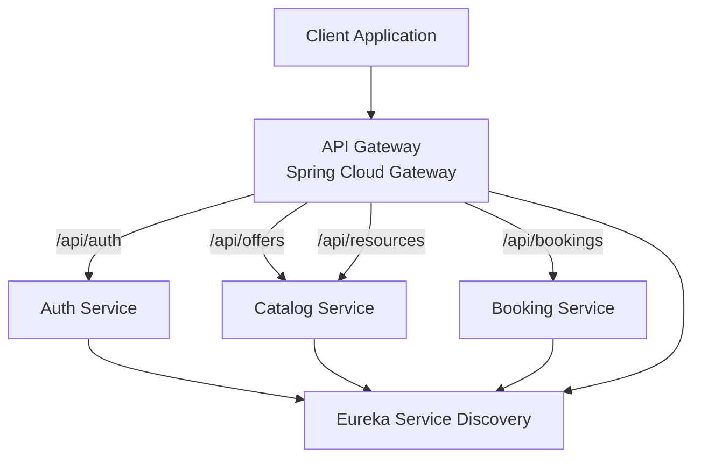

# SmartBookingPlatform

A **microservices-based booking platform** built with **Spring Boot and Spring Cloud**, demonstrating a modern backend architecture with service discovery, API gateway routing, JWT authentication, and load testing.

> Designed as a learning and architecture exercise to explore distributed systems concepts commonly used in production environments.

---

## Features

- Microservices architecture
- API Gateway routing
- JWT authentication
- Service discovery with Eureka
- Resilient service-to-service communication
- Load testing with k6

---

## Table of Contents

- [Architecture Overview](#architecture-overview)
- [Technologies Used](#technologies-used)
- [API Gateway Routing](#api-gateway-routing)
- [Authentication Flow](#authentication-flow)
- [API Documentation](#api-documentation)
- [Running the Platform](#running-the-platform)
- [Load Testing](#load-testing)
- [Project Structure](#project-structure)
- [Design Principles](#design-principles)
- [Known Limitations & Future Work](#known-limitations--future-work)

---

## Architecture Overview

The platform follows a microservices architecture where each service owns a specific business capability. All services communicate via REST APIs using OpenFeign clients and register with the Eureka Discovery Server for dynamic service resolution.

| Service | Responsibility |
|---|---|
| **API Gateway** | Single entry point — routing and authentication |
| **Auth Service** | User registration and JWT authentication |
| **Catalog Service** | Management of service offers and resources |
| **Booking Service** | Booking creation and availability |
| **Discovery Service** | Service registry using Netflix Eureka |

### System Diagram



The **API Gateway** acts as the single entry point, forwarding requests to the appropriate services while enforcing authentication. All services register with the **Eureka Discovery Server** and are resolved dynamically at runtime.

---

## Technologies Used

### Backend
- Java 21
- Spring Boot, Spring Web, Spring Data JPA, Spring Security

### Microservices Infrastructure
- Spring Cloud Gateway
- Netflix Eureka (Service Discovery)
- OpenFeign

### Security
- JWT Authentication
- Spring Security

### Data
- PostgreSQL
- Hibernate / JPA

### Messaging
- RabbitMQ — used for log and event streaming

### Testing
- JUnit, WebTestClient, Mockito
- k6 — load testing

### Documentation
- Swagger / OpenAPI

---

## API Gateway Routing

All requests enter through the gateway at `http://localhost:8080`. Protected routes require a valid JWT token issued by the Auth Service.

| Route | Target Service |
|---|---|
| `/api/auth/**` | Auth Service |
| `/api/offers/**` | Catalog Service |
| `/api/resources/**` | Catalog Service |
| `/api/bookings/**` | Booking Service |

---

## Authentication Flow

1. Client registers via `POST /api/auth/register`
2. Auth Service validates credentials and returns a JWT token
3. Client includes the token in subsequent requests:
   ```
   Authorization: Bearer <JWT_TOKEN>
   ```
4. API Gateway validates the token before routing the request

---

## API Documentation

Swagger UI is available per service while the platform is running:

| Service | Swagger URL |
|---|---|
| Auth Service | http://localhost:8081/swagger-ui.html |
| Catalog Service | http://localhost:8082/swagger-ui.html |
| Booking Service | http://localhost:8083/swagger-ui.html |

---

## Running the Platform

### Start

```bash
./start-platform.sh
```

This script will:
1. Start infrastructure services using Docker
2. Launch all microservices
3. Wait until all services become available

Gateway is available at: `http://localhost:8080`

### Stop

```bash
./stop-platform.sh
```

Terminates all running services and containers.

---

## Load Testing

Load testing is performed using **[k6](https://k6.io)**. Three scenarios are included:

**Authentication Baseline Test**
Simulates concurrent user registration and login.

**Catalog Load Test**
Simulates multiple users querying service offers.

**Booking Flow Test**
Simulates the full flow: authentication → offer retrieval → booking creation.

Run a test:
```bash
k6 run k6-tests/catalog-load-test.js
```

---

## Project Structure

```
SmartBookingPlatform_V1/
├── api-gateway/
├── auth-service/
├── catalog-service/
├── booking-service/
├── discovery-service/
├── k6-tests/
├── docker-compose.yaml
├── start-platform.sh
└── stop-platform.sh
```

Each microservice follows a layered architecture:

```
├──config/       → application and security configuration
├──controller/   → REST endpoints
├──service/      → business logic
├──repository/   → data access layer
├──model/        → domain entities
├──dto/          → API request/response objects including request validation
├──exception/    → custom domain exceptions
└──logging/      → logging filters and interceptors
```

---

## Design Principles

- **Service autonomy** — each service owns its data and logic
- **Loose coupling** — services interact only via APIs
- **Stateless authentication** — JWT-based, no server-side session
- **Centralized entry** — all traffic flows through the API Gateway
- **Independent scalability** — each service can scale on its own

---

## Known Limitations & Future Work

### V1 — Current Limitations

This version focuses on architecture fundamentals. The following are known gaps:

- No Kubernetes orchestration
- No centralized logging
- No distributed tracing
- No CI/CD pipeline

### V2 — Planned Improvements

| Area | Planned Change |
|---|---|
| Containerization | Docker images for all services |
| Orchestration | Kubernetes deployment |
| Observability | Prometheus + Grafana stack |
| Tracing | Distributed tracing |
| Delivery | CI/CD pipeline |